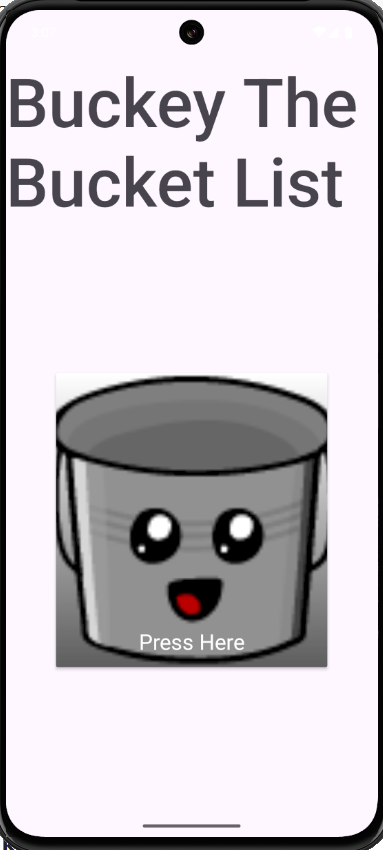
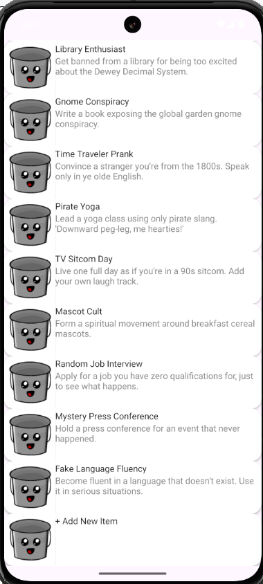

# Bucket List App

An app I created to practice my initial learning for Android Development

## Features

- A main screen with navigation to bucket list array screen
- A scrollable list of bucket list items
- A detail screen for each item
- Add new items with a dedicated form screen
- Tap and remove items after viewing their detail screen
- CardView UI using RecyclerView
- Built with reusable code structure for easy updates

## Teck Stack
- Language: Java
- IDE: Android Studio
- UI: XML, CardView, RecycvlerView, ImageView, TextView
- Min SDK: 21

## ScreenShots

